# Microservices Security with Keycloak

## Table of contents

- [1. Download Keycloak](#Download-Keycloak)
- [2. Start Keycloak](#Start-Keycloak)
- [3. Create an Admin Account](#Create-an-Admin-Account)
- [4. Create Realm](#Create-Realm)
- [5. Create a client to secure](#Create-a-client-to-secure)
- [6. Create users](#Create-users)
- [7. Create roles](#Create-roles)
- [8. Assign roles to users](#Assign-roles-to-users)
- [9. Tests with Postman](#Tests-with-Postman)
- [10. Securing the Micro services architecture of the Customer-service, Inventory-service and Order-service project](#Securing-the-Micro-services-architecture-of-the-Customer-service,-Inventory-service-and-Order-service-project)

## Download Keycloak

 
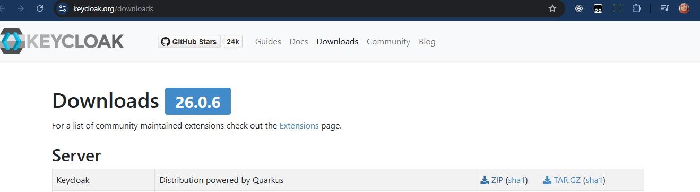
 

## Start Keycloak

 
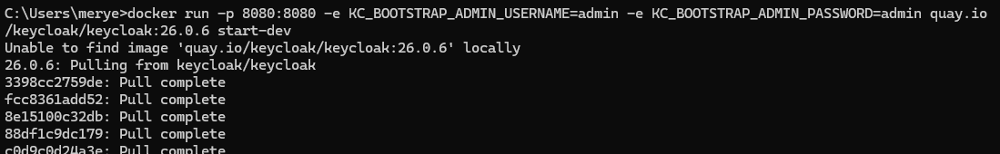
 

## Create an Admin Account

 
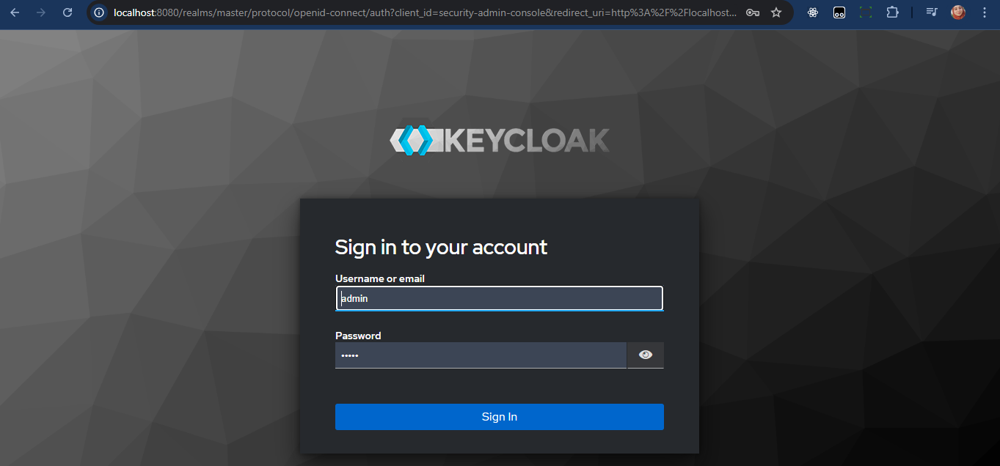
 

## Create Realm

 
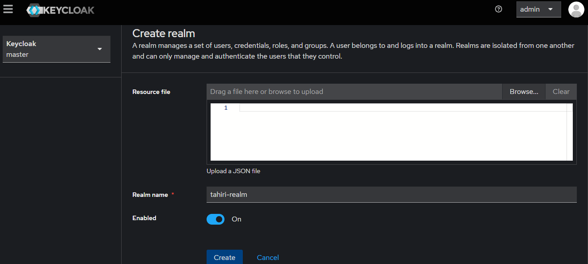
 

## Create a client to secure

 
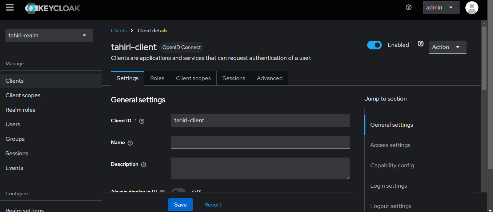
 

 
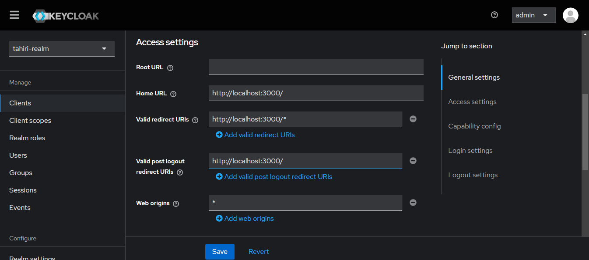
 

 
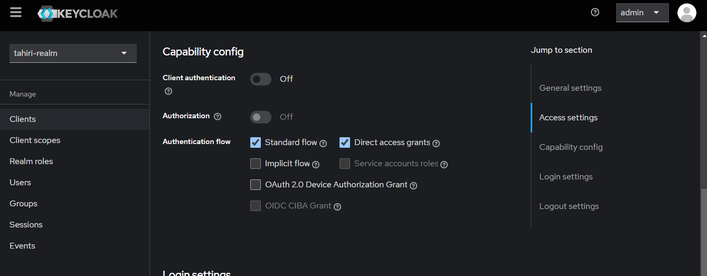
 

## Create users

 
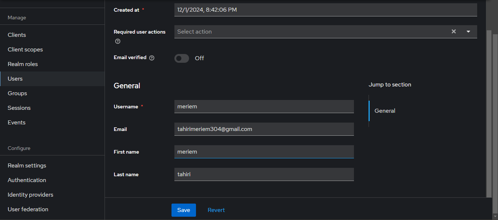
 

 
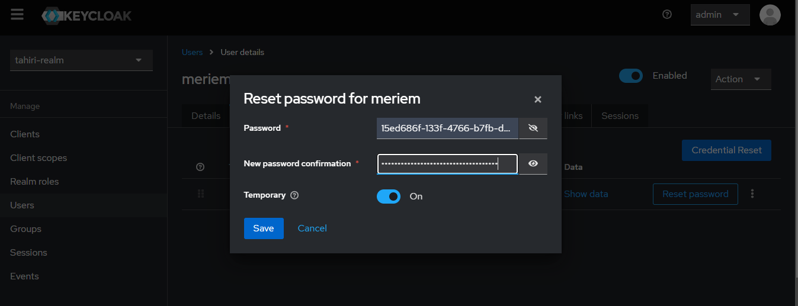
 

## Create roles

 
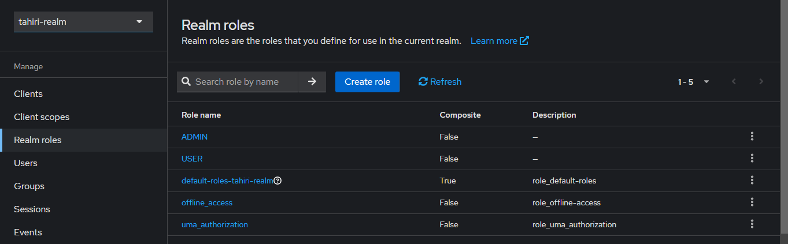
 

## Assign roles to users

 
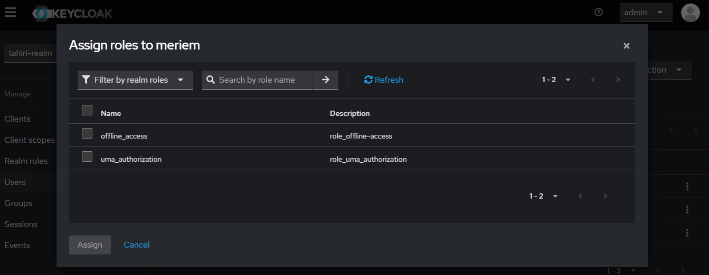
 

## Tests with Postman

#### Test authentication with password

 
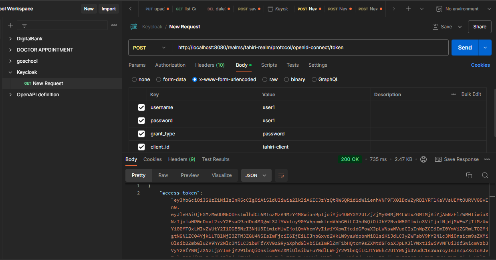
 

#### Analyze the contents of the two JWT Access Token and Refresh Token

 
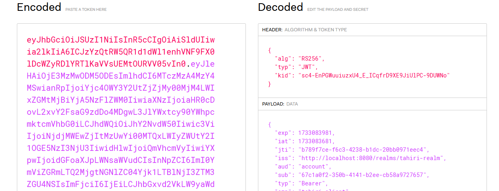
 

 
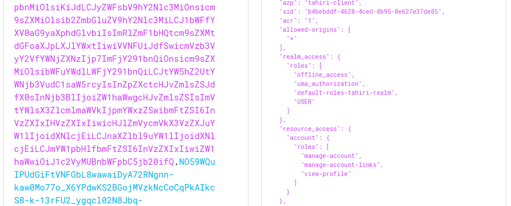
 

#### Test authentication with the Refresh Token

 
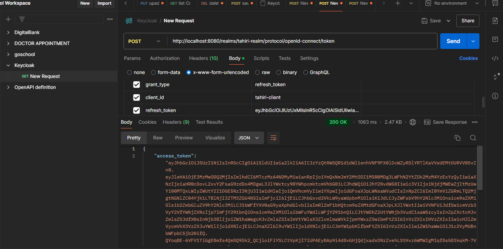
 

#### Test authentication with Client ID and Client Secret

 
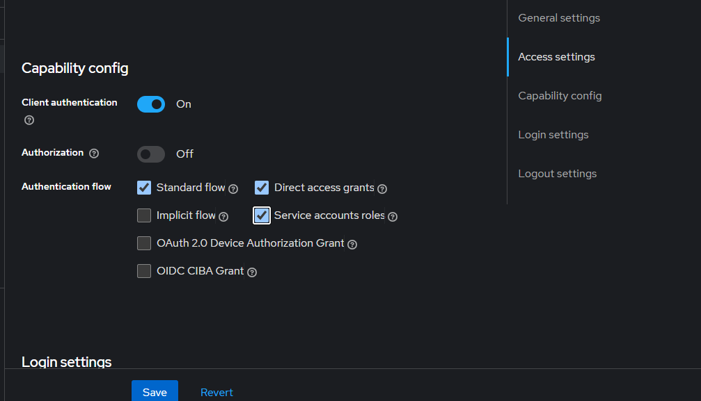
 

 
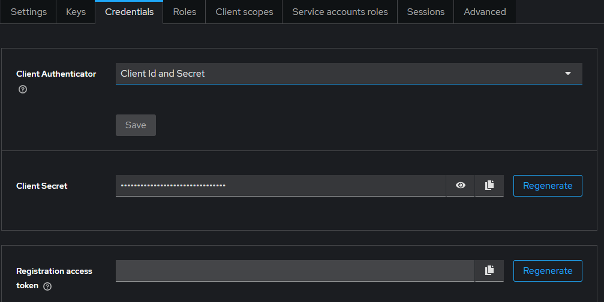
 

 
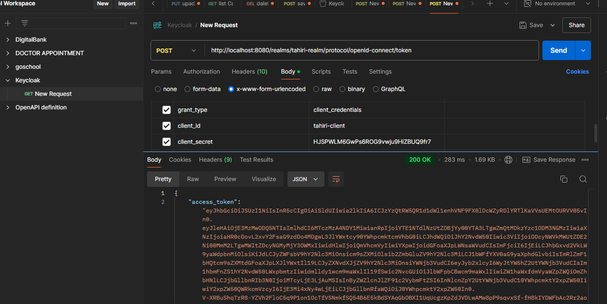
 

#### Change Access Token and Refresh Token Token Settings

 
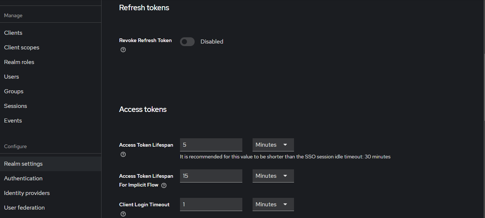
 

## Securing the Micro services architecture of the Customer-service, Inventory-service and Order-service project

 

 

 

 

