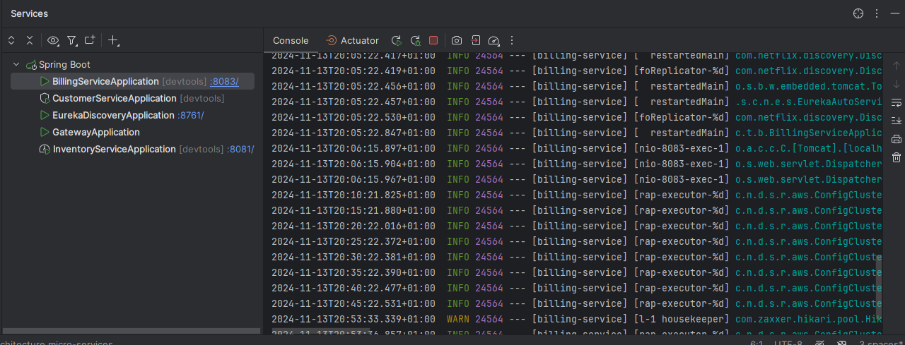
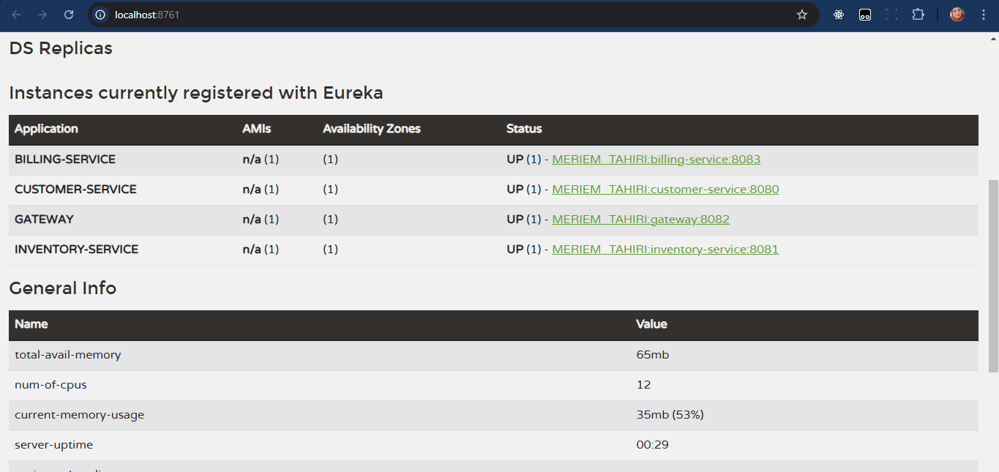
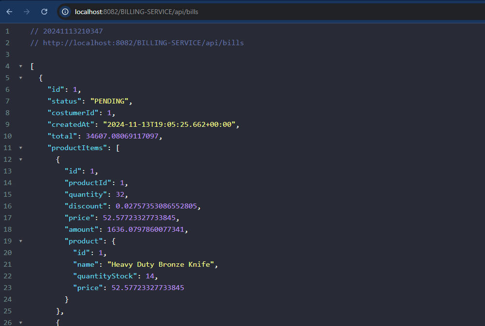
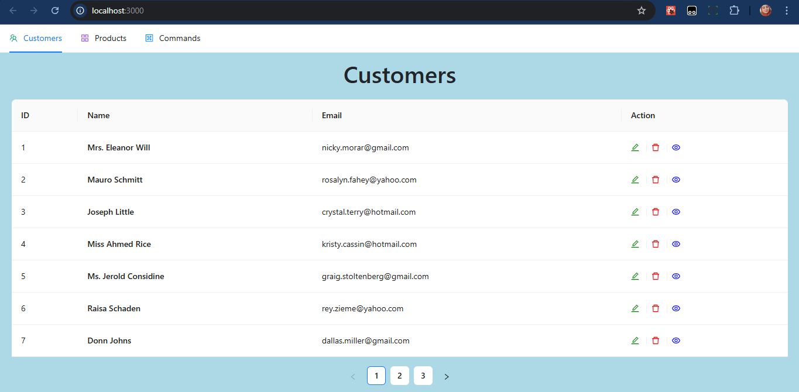
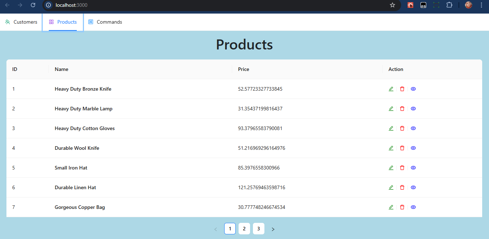
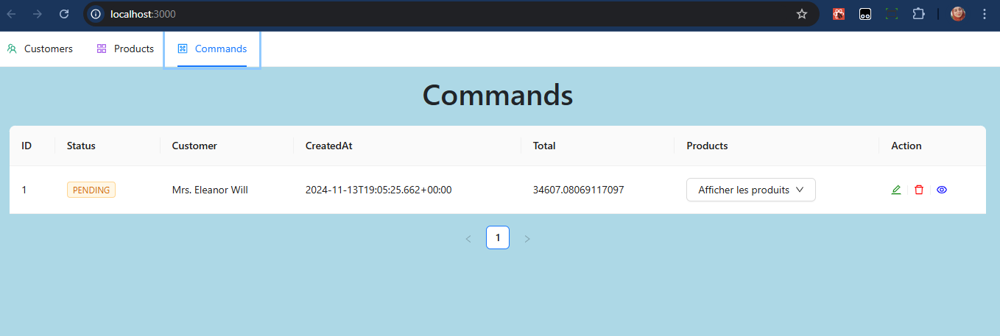

# Micro Services Architecture-Consul-Config- Gateway-Feign-Resilience4J

orders - customers - products Microservices using Spring boot and consul.

## Table of contents

- [Project Architecture](#project-architecture)
- [Consul Disovery Service](#consul-disovery-service)
- [command Service](#command-service)
- [Frontend](#frontend)

## Project Architecture

In this project we have the following services:

    1. Customer Service :
        My job is not complicated ,I will handle CRUD operations for our customers ✔

    2. Product service :
        I will be here for handling CRUD operations for invoices ✔

    2. Order service :
        I will be here for handling CRUD operations for orders ✔

    3. OpenFeign :
        I will get customer and product details if any order ask me about them 🤷‍♂️

    4. Consul Disovery Service :
        I will holds the information about all other services 😎

    5. Gateway :
        Your clients will send me their requests, then I will send it to the wanted service 😜

## Consul Disovery Service

 
First, let's run our services :

 

 

 
then let's check them in the consul interface :

 

 

## command Service

 

 

 

 

## Frontend

 

 

 

 

 
